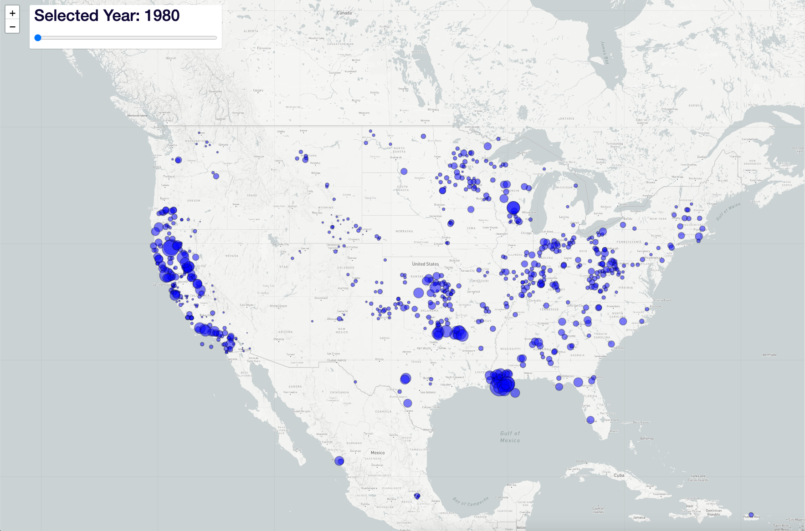
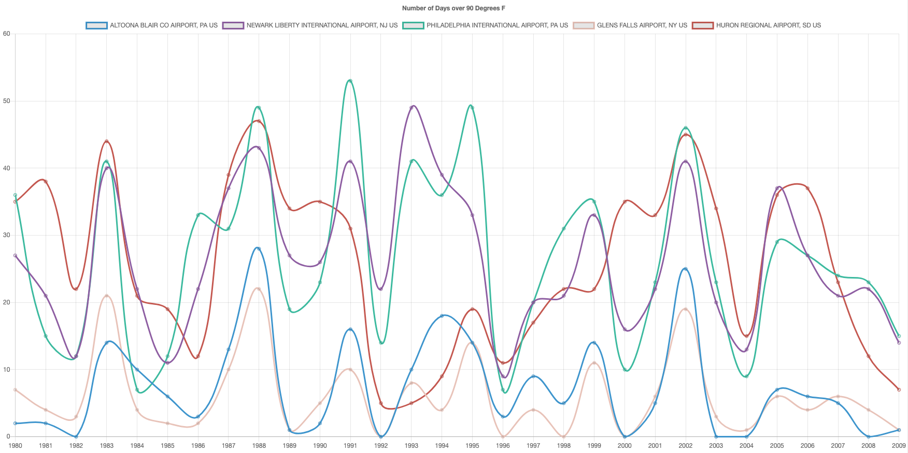
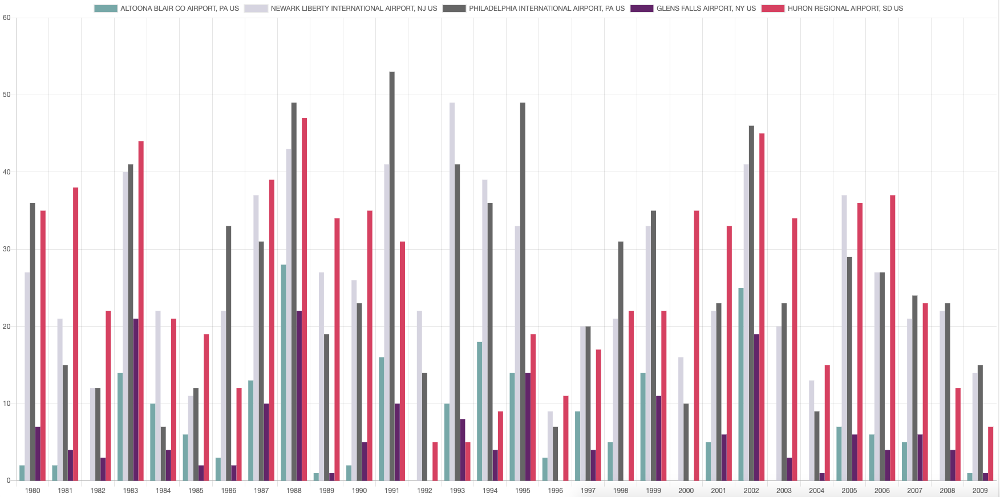

# Climate Change Visualization

This project was completed by [Abla](https://github.com/Abla-Beatrice), [Kelsie](https://github.com/kelsiehargita) and [Winnie](https://github.com/climbr88) with invaluable assistance from [Dr Boahemaa Adu-Oppong](https://github.com/abenaa07).

The purpose of this data dashboard is looking at various aspects of climate change via the use of datasets and graphs that clearly demonstrate the Maximum Precipitation, Maximum Temperature and Maximum Snowfall & Snow Depth in United States. 

* Maximum Precipitation

* Maximum Temperature Line_Chart

* Maximum Temperature Bar_Chart

* Maximum Snowfall

* Maximum Snow Depth

* Maximum Snowfall & Snow Depth 

* Features:

   * Python APIs
   * Pandas
   * SQL 
   * HTML/CSS 
   * D3.js 
   * JavaScript

 

    LINK
     
    <a href="https://github.com/Abla-Beatrice/The-Weather-Girls"><strong> Repository</strong></a>
       
  

## ETL

**NOAA** Climate.gov Data
[Here](https://www.climate.gov/maps-data/datasets/formats/json "LINK")

A range of environmental datasets (weather, air & sea temperature) mainly for the US.

Link to **NOAA API** used [Here](https://www.ncdc.noaa.gov/cdo-web/webservices/v2#datasets)

**Mapbox**

Overview of the Mapbox Maps service APIs [Here](https://docs.mapbox.com/api/maps/)

## Technologies Used

- [Python 3.6.10](https://docs.python.org/3.10/library/) and its ecosystem are extremely popular tools in the world of data analysis.

- [JavaScript](https://developer.mozilla.org/en-US/docs/Web/JavaScript)
    - The project uses JavaScript to add interactivity to the dashboard and to retrieve certain data from CSV files for graphs and charts.

- [Chart.js](https://d3js.org/)
    - The project uses Chart.js order to style the prebuilt charts.

## Deployment

- The dashboard is hosted via GitHub Pages and is deployed from the master branch - this is to allow the deployed dashboard to automatically update with any new commits that are made to the master branch.

    - To deploy the dashboard to GitHub Pages, first clicked the settings tab on the GitHub repository for the site.
    - From here, scrolled to the GitHub Pages section of the setting tab and changed the Source from 'none' to 'master branch'.
    - This deployed the dashboard to GitHub Pages and provided me with a link to the hosted page, which then copied and pasted into the description of the repository.
    
- To run this application locally:
    - Click the green 'clone or download' button in the [GitHub repository for the project](https://github.com/Abla-Beatrice/The-Weather-Girls).
    - Copy the link provided by clicking the clipboard button to the right of the link.
    - In your terminal, type `git clone`, paste in the previously copied link, and hit return.
    - The application should now be installed on your device.

## Credits

### Content
- Template used [Mashup Template](http://www.mashup-template.com/templates.html) 

- To create a slider for visualization, go to [Mapbox GL JS](https://docs.mapbox.com/mapbox-gl-js/example/timeline-animation/)

### Media

- The image used in the dashboard  can be found at [Unsplash](https://unsplash.com/).
